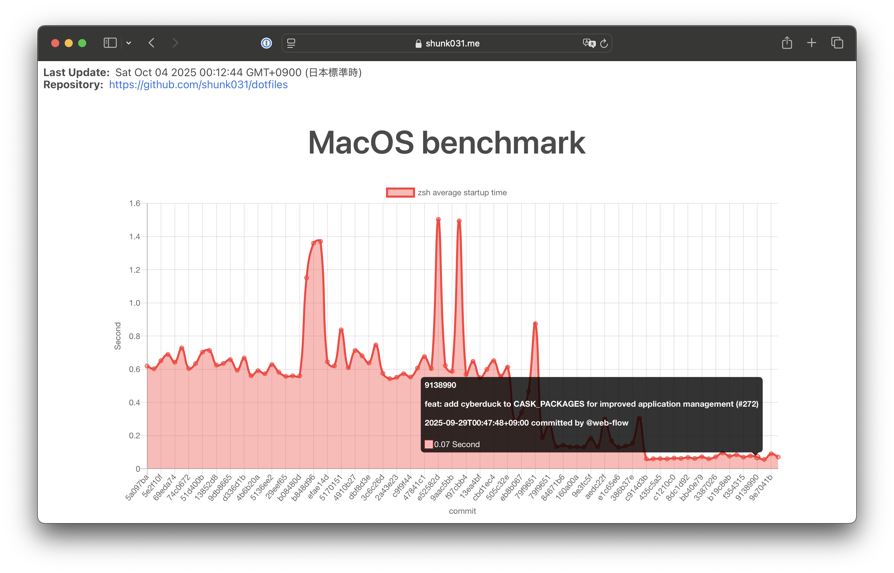

# `shumk031/dotfiles` Benchmark Viewer

This repository hosts and publishes my zsh startup benchmark results. 

- My [`shunk031/dotfiles`](https://github.com/shunk031/dotfiles) repo continuously executes benchmarks via its workflow: [`.github/workflows/macos.yaml`](https://github.com/shunk031/dotfiles/blob/master/.github/workflows/macos.yaml), using [`benchmark-action/github-action-benchmark`](https://github.com/benchmark-action/github-action-benchmark).  
- That workflow collects and visualizes performance data and pushes the results to this repository’s [`gh-pages`](https://github.com/shunk031/my-dotfiles-benchmarks/tree/gh-pages) branch.  
- You can view the published benchmark site at: https://shunk031.me/my-dotfiles-benchmarks/  
- This repo contains the processed data, visual assets, and site files (e.g., `index.html` and `data.js`).  
